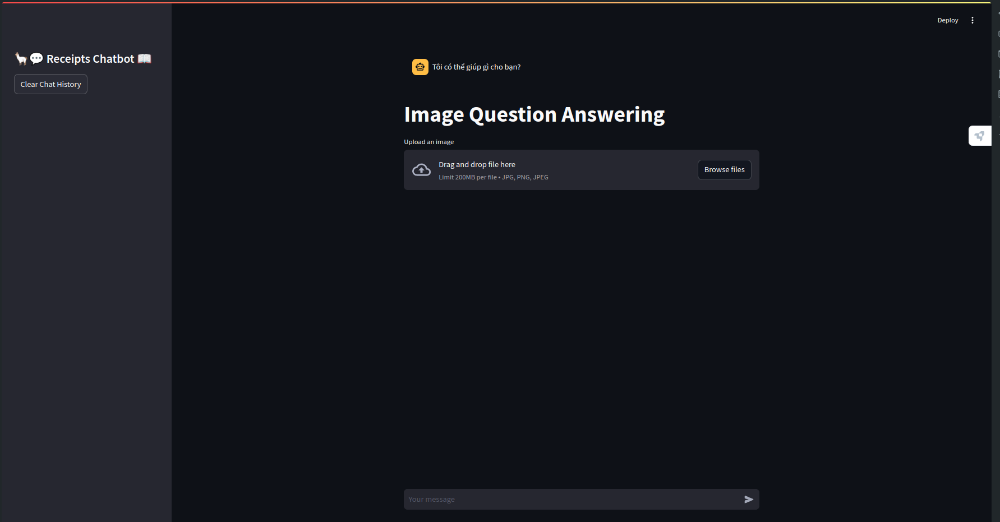
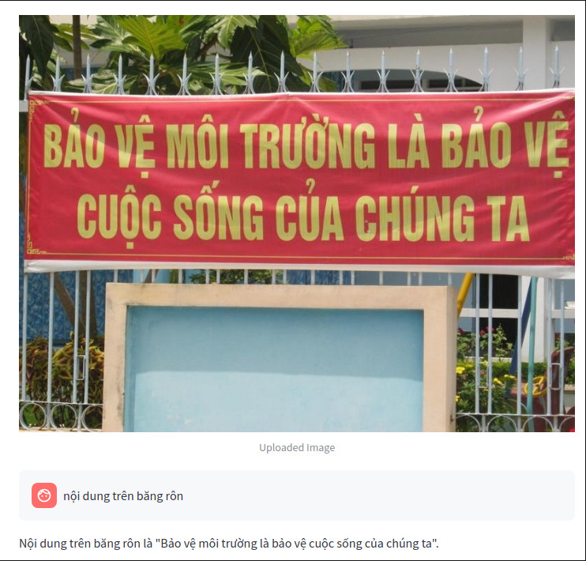
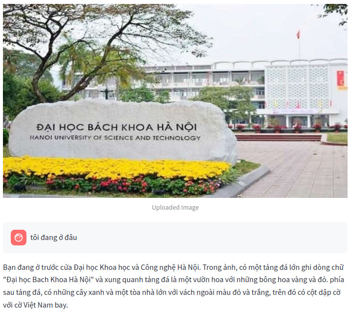

# 💬 Vietnamese Scene Question Answering 📖

## Introduce

In this project, We will using easyOCR, vision language models Florence2 and llms Qwen2 to build chatbot for **Vietnamese Scene Question Answering**

To know more about above models, please direct to:

- [Easyocr](https://github.com/JaidedAI/EasyOCR)
- [Florence2](https://huggingface.co/microsoft/Florence-2-large)
- [Qwen2](https://qwenlm.github.io/blog/qwen2/)

## Overview of the app

<div align="center"></div>

## Installation and Requirements

<!-- [ABSTRACT] -->

1. Clone project:

```
git clone ...
cd vietnamese_VQA/

```

1. Create conda environments:

```
conda create --name <ENV_NAME> python=3.11 -y
conda activate <ENV_NAME>

```

1. Install [torch](https://pytorch.org/) follow pytorch instruction
2. Run this command to install dependenies in the requirements.txt file

```
pip install -r requirements.txt

```

**Notes**: you must install Cuda 12.3 or 11.8, so you can using flash attention to speed up your model loading from huggingface

## Run Project

1. Run the streamlit server

```
streamlit run app.py

```

1. Access the application in your browser at [[http://localhost:8501](http://localhost:8501/)].
2. Start chatting with the assistant!

## How it works

The app as follows:

1. The user enters an image in the upload image field.
2. User enters a question about uploaded image.
3. User messages are sent to the OCR and Florence2 model for processing.
4. The user's input, along with the chat history, is used to text input for Qwen2 LLMs
5. The Qwen2 model generates a response based on the patterns it learned during training.

## Some of Results
<div align="center"></div>
<div align="center"></div>
